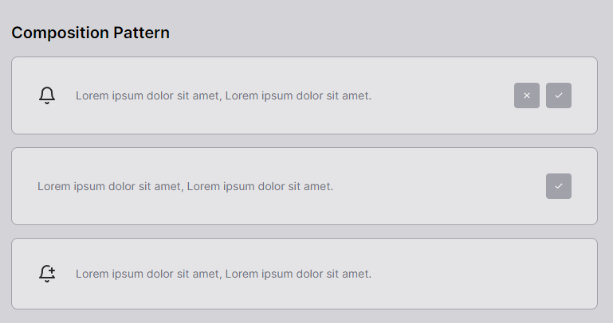

# React Composition Patter 📦

## Commands

Replace pnpm with your choice of npm / yarn

| Command          | Action                                                         |
| :--------------- | :------------------------------------------------------------- |
| `pnpm install`   | Installs dependencies                                          |
| `pnpm dev`       | Starts local dev server at `localhost:3000`                    |
| `pnpm build`     | Build your production site to `./dist/`                        |

## Introduction

Developing and maintaining a large-scale React application can often be challenging. That's why there are patterns to help us organize the structure of our application, making maintenance more manageable.

I'll introduce a pattern that I find highly effective: the Composition Pattern, using React with TypeScript, Tailwind CSS, Tailwind Merge for custom styles, and incorporating the Lucide icon library.

## Understanding the Basics

Instead of getting tangled up in complex hierarchies and component inheritance, the Composition Pattern emphasizes the idea of building smaller, specialized components, each focused on a specific task.

1. **Composition Over Inheritance:**

- While inheritance involves creating base and derived classes, composition emphasizes building objects composed of other objects.

- It reduces issues related to deep inheritance hierarchies, keeping things simpler and more understandable.

2. **Composite Objects:**

- Instead of inheriting behaviors, a composite object includes instances of other objects, each with specific behaviors.

- Each object is specialized for a specific task, encouraging code reuse.

3. **Flexibility and Modifiability:**

- Composition offers more flexibility compared to inheritance, allowing dynamic addition, removal, or replacement of behaviors during execution.

- Modifications to one component don't directly impact other components.
